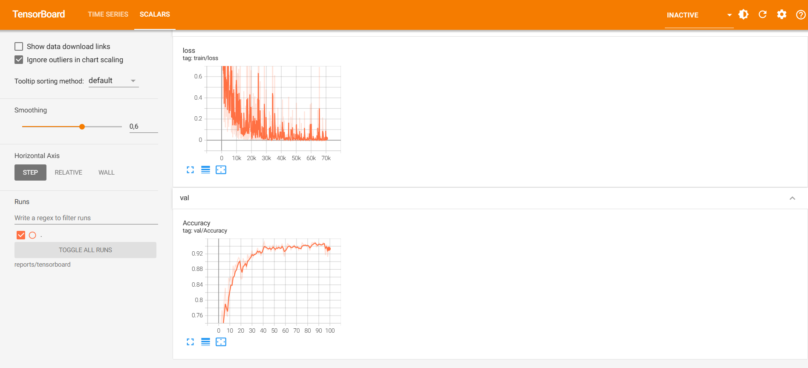

# Brain Tumor MRI (Image classification)

Ứng dụng học sâu (Deep Learning) vào bài toán phân loại ảnh MRI não nhằm hỗ trợ phát hiện và phân loại các loại u não.

---

## 1.chức năng
- dự đoán ảnh MRI  
- loại khối u tương ứng:
  - Glioma tumor
  - Meningioma tumor
  - Pituitary tumor
  - No tumor (não bình thường)

## 2. kết quả quá trình train


---

## 3. Cấu trúc thư mục

```text
BrainTumorMRI/
├── data
│   └── raw
│       ├── Testing
│       │   ├── glioma
│       │   ├── meningioma
│       │   ├── notumor
│       │   └── pituitary
│       └── Training
│           ├── glioma
│           ├── meningioma
│           ├── notumor
│           └── pituitary
├── deploy
├── reports
│   └── tensorboard
├── src
├── templates
├── trained_models
└── uploads
```
## 4 Dataset

### 4.1 Tải dữ liệu

- Kaggle (khuyên dùng):  
  https://www.kaggle.com/datasets/sartajbhuvaji/brain-tumor-classification-mri


### 4.2 Cách dùng dữ liệu
1.Đặt vào thư mục:
```text
data/raw/
```

## 5. Cài đặt

### 5.1 Tạo môi trường ảo (khuyên dùng)

```bash
python -m venv venv
```

**Windows**
```bash
venv\Scripts\activate
```

**Linux / macOS**
```bash
source venv/bin/activate
```

---

### 5.2 Cài thư viện

```bash
pip install -r requirements.txt
```

## 6. chỉnh cấu hình tham số mặc định
```text
config.py
```

---

## 7 Train model **(BẮT BUỘC)**

### 7.1 chạy các lệnh sau

```bash
python -m src.train 
```

### 7.2 Model sau khi train sẽ nằm trong:
```text
trained_models/best_cnn.pt
trained_models/last_cnn.pt
```

---
## 8. chạy docker file
### 8.1 build docker image
```bash
docker build -t braintumor .
```

### 8.2 vào trong container
```bash
docker run -it --rm --gpus all -v ${PWD}/data/raw:/BrainTumor/data/raw -v ${PWD}/trained_models:/BrainTumor/trained_models -v ${PWD}/uploads:/BrainTumor/uploads  braintumor bash
```
sau khi vào xong chạy lệnh train model như 7.1 để lấy check point

### 8.3 nếu có checkpoint chạy luôn app
```bash
docker run  --rm -p 5000:5000 --gpus all -v ${PWD}/trained_models:/BrainTumor/trained_models -v ${PWD}/uploads:/BrainTumor/uploads  braintumor 
```


## 9. xem quá trình train và triển khai test thử

1. xem quá trình train
```bash
tensorboard --logdir reports/tensorboard
```
2. test thử
```text
python -m src.inference -p (đường dẫn ảnh)
```

## 10. Chạy ứng dụng wed

```bash
python app.py
```
Mặc định ứng dụng chạy tại:

http://127.0.0.1:5000

---